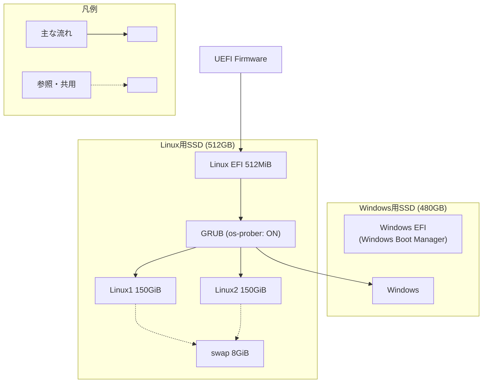

## 1. 始めに

[以前の記事]()
ではWindowsからZorinに引っ越した際の初期設定や普段使うアプリケーションを紹介しました。
しかし、パーティションやブートローダの設定は初心者には難しいと感じたため、紹介しませんでした。

本記事では既存のWindowsを残したまま、別のSSDにLinuxディストリビューションを複数インストールできる構成を紹介します。
なお、どの用途でパーティションを分割するか、どこにブートローダを置くかなどの設計面に重点を置きます。

## 2. 想定する読者

本記事は以下の読者を想定しています。

- Windowsを残したままLinuxディストリビューションを導入したい方
- Linuxディストリビューションを複数インストールしたい方
- デュアルブートやブートローダの構成で迷っている方

逆にLinuxを1つのみインストールする場合や、既存ディスクを初期化して入れ替える場合は、本記事の構成は不要かと思います。
その一方で後から別のLinuxディストリビューションを試したくなる可能性がある場合は、最初にある程度余裕を持って設計しておくと管理しやすいと思います。

## 3. パーティションの設計方針と構成

以下の設計方針に基づいて構成を考えました。

- 起動用の領域（EFIパーティション）はLinux用とWindows用で各々1つのみ作成して、分離する
  - Linuxは複数のディストリビューションで共用する
- スワップ領域（swapパーティション）はLinux用で1つのみ作成して、共用する
- 複数のLinuxディストリビューションをインストールできる余裕を持たせる
- 全てのOSを自動検出させる

まずは細かい設定は抜きにして、構成の全体像をお見せします。
また、一応補足しておくとUEFIはBIOSの進化版のファームウェアです。



## 4. 構築手順

既存のWindows用SSDとは別にLinux用SSDを増設しましたので、
複数のLinuxディストリビューションをインストールできるように構築しました。

### 4.1. Linux用SSDのパーティション作成

GParted（ディスク管理アプリ）で以下の通りにパーティションを編集します。
画面上のサイズは10進数ではなく2進数なので、MiB表記で入力してください。

| ラベル    | サイズ   | サイズ(MiB表記) | ファイルシステム | フラグ        | 備考       |
| --------- | -------- | --------------- | ---------------- | ------------- | ---------- |
| Linux EFI | 512MiB   | 512MiB          | FAT32            | `boot`, `esp` |            |
| swap      | 8GiB     | 8192MiB         | linux-swap       |               | 共用       |
| Linux1    | 150GiB   | 153600MiB       | ext4             |               |            |
| Linux2    | 150GiB   | 153600MiB       | ext4             |               |            |
| free      | 約200GiB | 約204800MiB     |                  |               | 未割り当て |

### 4.2. Linuxディストリビューションのインストール

OS本体のインストール手順については画面に従って進めるだけなので詳細は割愛して、注意事項のみお伝えします。

| 項目             | 設定値                                      | 備考 |
| ---------------- | ------------------------------------------- | ---- |
| インストール先   | Linux1, Linux2                              |      |
| マウントポイント | `/`                                         | (1)  |
| ブートローダ     | Linux用SSD (例: `/dev/sda`, `/dev/nvme0n1`) | (2)  |

- (1) そのパーティションをLinux上のどの場所として使うかを表す
- (2) パーティションではなくディスクを指定することで、Linux用のEFIパーティション(Linux EFI)を共用する

### 4.3. 共用のスワップ領域の設定

```shell
# UUID確認
sudo blkid
# UUID追加(追加内容参照)
sudo vi /etc/fstab
# 有効化
sudo swapon -a
# 確認
swapon --show
free -h
```

追加内容:

```ini
# /etc/fstab
UUID=xxxx none swap sw 0 0
```

### 4.4. 起動順序（BootOrder）の設定

起動順序とブートエントリを確認して、以下の通りに設定します。

```shell
# 起動順序の確認
sudo efibootmgr
# 起動順序の設定（例）
sudo efibootmgr -o 0002,0003,0001
```

設定項目:

| 項目                    | 設定値           | 設定値(例)             | 備考 |
| ----------------------- | ---------------- | ---------------------- | ---- |
| BootOrder               | ブート番号リスト | `0002,0003,0001`       |      |
| BootNNNN (例: Boot0001) | Windows EFI      | `Windows Boot Manager` |      |
| BootNNNN (例: Boot0002) | Linux1           | `Zorin OS`             |      |
| BootNNNN (例: Boot0003) | Linux2           | `Kubuntu`              |      |

## 5. 最後に

本記事ではWindows用SSDとは別にLinux用SSDを増設し、Linuxディストリビューションを複数インストールしやすくするための設計方針と構築手順を紹介しました。
今回のポイントはWindows用とLinux用でEFIパーティションを分離しつつ、Linux側ではEFIパーティションとswapパーティションを共用することです。

この構成にしておくと、Windows環境への影響を抑えながらLinuxを追加したり入れ替えたりしやすくなります。
また、ブートローダの配置先や起動順序を整理しやすいため、後から見返した時にも構成を把握しやすいです。

Linuxディストリビューションを1つのみ試す段階では少し手間のかかる構成ですが、
今後いくつかのLinuxディストリビューションを比較しながら使いたい場合、管理しやすい方法だと考えています。

## 6. 参考URL

- [Zorin OS - Make your computer better.](https://blog.zorin.com/2026/04/15/zorin-os-18.1-is-released/)
